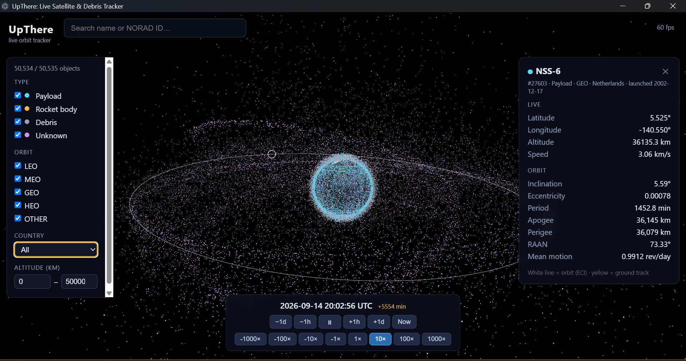
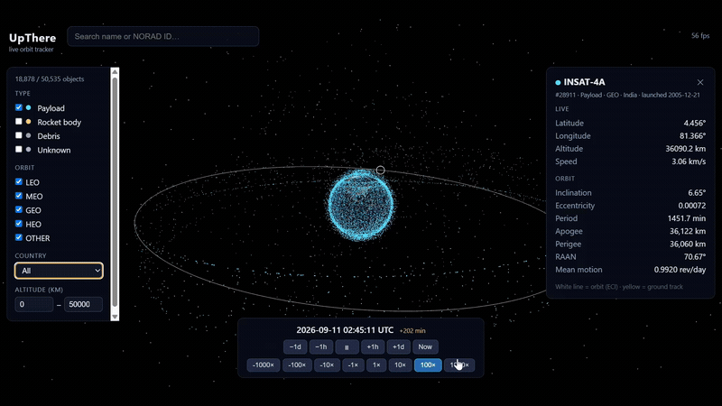

# UpThere



**Real-time 3D satellite & debris tracker.** Every tracked object in Earth
orbit (~36,000 satellites, rocket bodies, and debris fragments) rendered on
an interactive globe with positions propagated live in your browser or as a
desktop app.

[](LICENSE)
[](https://github.com/MyBROSKICicada3301)
[](https://www.linkedin.com/in/shishir-s-nambiar/)

## Two ways to see the sky

The same live catalogue, over your choice of globe. Switch from the **Chart**
panel; the choice is remembered.

**Modern** — the photographic day/night globe, with the terminator following
the real sun.

**Mythos** — a pen-and-ink world chart in the style of a Renaissance atlas:
quill-wobbled coastlines, engraved shading banding out from every shore, hill
hachures raised over the real uplands, a 16-point compass rose, galleons under
sail, sea serpents, and *hic svnt dracones* lettered across the Indian Ocean.
The whole interface follows the globe onto parchment. Nothing is downloaded to
make it — the chart is drawn at runtime from the two textures the app already
ships (see [How it works](#how-it-works)).

Either globe takes one of two data overlays:

- **Winds** — the three-cell circulation: polar easterlies, mid-latitude
  westerlies meandering as Rossby waves, and trade-wind arcs slanting toward
  the equator. On the Mythos chart the eight **Anemoi** ride above the belts,
  each cherub's breath swung round to the true bearing of the wind beneath it,
  so the decoration and the data agree. Over the photographic globe the belts
  are drawn plain.
- **Seas** — the five subtropical gyres, the western boundary currents that
  feed them (Gulf Stream, Kuroshio, Agulhas, Humboldt) and the Antarctic
  Circumpolar, with a turning whirlpool at every gyre centre.

Both animate: a pulse travels along each ribbon in the direction of flow, on
wall-clock time rather than simulation time — a gyre whipping round at 1000×
would read as noise.

## Features

- **Full catalog, live.** The complete public catalog animates at 60 fps,
  each object at its SGP4-propagated position.
- **True orientation.** The globe rotates in real sidereal time; the
  day/night terminator follows the actual sun position.
- **Time control.** Pause, run at ±1× to ±1000×, jump by hours or days.
  Propagation works at any epoch, so the past and future are one scrub away.
- **Search & filter.** By name, NORAD ID, object type (payload / rocket
  body / debris), orbit regime (LEO / MEO / GEO / HEO), country/operator,
  and altitude band.
- **Object details.** Click any dot or search-select: live latitude/
  longitude/altitude/speed, orbital elements, orbit line, and ground track.
- **Two chart styles and two overlays**, as above — none of which touches the
  propagation pipeline.

## Demo

Tracking [INSAT-4A](https://www.isro.gov.in/INSAT_4A.html?timeline=timeline)
in geostationary orbit, running at 1000× speed:



[Full-quality clip (MP4)](docs/img_vid/UpThere.mp4)

## Quick start (web)

Requirements: Node.js 20+.

```sh
npm install
cp .env.example .env.local   # optional: add your KeepTrack API key
npm run dev                  # http://localhost:5173
```

Orbital data comes from the [KeepTrack API](https://api.keeptrack.space)
(free tier available). Either put your key in `.env.local` or just start the
app, which will ask once and store the key locally on your device.

## Desktop app (Windows)

```sh
npm run dist
```

Produces a portable, no-install executable at
`release/UpThere-<version>-portable.exe`. For a quick unpackaged run:

```sh
npm run desktop
```

## How it works

The short version:

1. The catalog's orbital elements (TLEs) are fetched **once** in bulk and
   cached in IndexedDB for 3 hours, since elements drift slowly.
2. A pool of Web Workers runs the SGP4 propagator
   ([`ootk`](https://github.com/thkruz/ootk)) over catalog slices every few
   simulation seconds, returning positions and velocities as transferable
   arrays.
3. All objects render as a **single** `THREE.Points` draw call; the vertex
   shader dead-reckons `position + velocity × dt` between worker refreshes,
   so per-frame cost on the main thread is independent of object count.
4. The world frame is ECI: satellites need no transform, and the Earth mesh
   itself rotates by GMST, which is what makes the sidereal rotation and
   ground tracks exact.

**The Mythos chart ships no extra assets.** The specular texture already in
the repo turns out to be a clean land/water mask — no clouds or sea ice to
misread — so a signed distance field is built over it once, on the first
switch, and does three jobs at once: contoured at zero it gives the coastline,
contoured just below zero it gives the parallel engraved banding that hugs
every shore on a period chart, and tested directly it keeps hill hachures out
of the water. Hachure density comes from local relief in the colour texture,
normalised by luminance so the Sahara doesn't out-mountain the Alps. The roses,
ships, monsters and cherubs are canvas paths.

Both overlays are one triangle ribbon per path carrying arc length in dash
periods, so a whole layer is one draw call and one uniform write per frame.
Ribbons and figures are sized in screen space — a width fixed in kilometres is
a hairline at full-globe zoom and a stripe from low orbit.

The long version, including the threading model, coordinate conventions,
scheduling policy and the full chart pipeline:
[docs/ARCHITECTURE.md](docs/ARCHITECTURE.md).

## API key & deployment note

`VITE_KT_API_KEY` is embedded in the client bundle at build time. That is
acceptable for local development and personal desktop builds, but **do not
publish a hosted build with your key baked in**: proxy the KeepTrack API
through a small backend that attaches the key server-side, or leave the
variable unset so each user supplies their own key at first launch.

## Author

**Shishir S Nambiar**

- GitHub — [@MyBROSKICicada3301](https://github.com/MyBROSKICicada3301)
- LinkedIn — [shishir-s-nambiar](https://www.linkedin.com/in/shishir-s-nambiar/)

## Contributing

See [CONTRIBUTING.md](CONTRIBUTING.md).

## Acknowledgements

- Orbital data: [KeepTrack](https://keeptrack.space)
- SGP4 propagation: [ootk](https://github.com/thkruz/ootk)
- Earth textures: [three.js](https://github.com/mrdoob/three.js) examples

## License

[MIT](LICENSE)
